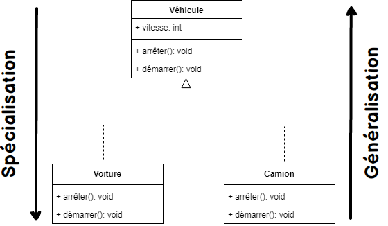

# POO JAVA

# La programmation orientée objet (POO) : 
  - Permet de créer des entités (objets) que l'on peut manipuler .

# Objet :
  - Un objet est une instance d'une classe  .
 
# Classe d’objet : 
  - Une classe peut être considérée comme une description de ce qu’il faut faire pour créer un objets .
  - Les classes sont composées de méthodes et d’attributs .

# Attributs :
  - Variables ou des objets nécessaires au fonctionnement d’un objet.

# Méthodes : 
 - Ou Fonctions  qui va nous permettre de créer des algorithmes de code que nous allons pouvoir faire appel quand on en a besoin. 
 - Cella va nous permettre de réduire nos lignes de code car on va simplement éviter de répéter notre code à chaque fois. 
 - Les méthodes sont utilisées pour effectuer certaines actions .

# Encapsulation : 
 - L'encapsulation permet de définir des niveaux de visibilité des éléments de la classe. Ces niveaux de visibilité définissent ce qu'on appelle la portée (ou encore le périmètre) .
 - En java 3 types de visibilité :
                 - Private : il est accessible uniquement depuis sa propre classe .
                 - Protected : il est accessible de partout dans le paquetage
                 - Public : il est accessible de partout dans le paquetage  et de partout d’ailleurs.

# Associations :
  - Une association représente une relation durable entre deux classes .
  - Exemple : Une personne possède une voiture. La relation possède est une association entre les classes Personne et Voiture. 

# Agrégation 
  - L'agrégation permet de définir une entité comme étant liée à plusieurs entités de classe différentes. 

# Composition
  - Elle indique une dépendance entre deux classes  .

# Généralisation et spécialisation des classes

f